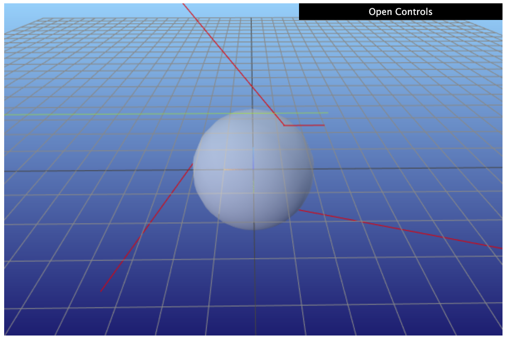

.. note::

    This is a static HTML version of an interactive Jupyter notebook in the examples folders of the pvtrace project.

.. code:: ipython3

    from pvtrace.scene.scene import Scene
    from pvtrace.scene.renderer import MeshcatRenderer
    from pvtrace.scene.node import Node
    from pvtrace.trace.tracer import PhotonTracer
    from pvtrace.geometry.sphere import Sphere
    from pvtrace.material.material import Dielectric
    from pvtrace.light.ray import Ray

Quick Start
===========

Let’s make a scene. The world is a giant sphere filled with air (radius
10) and shape we will ray trace is a sphere with radius 1.

A simple scene
--------------

.. code:: ipython3

    world = Node(
        name="world (air)",
        geometry=Sphere(
            radius=10.0,
            material=Dielectric.air()
        )
    )
    sphere = Node(
        name="sphere (glass)",
        geometry=Sphere(
            radius=1.0,
            material=Dielectric.glass()
        ),
        parent=world
    )
    scene = Scene(world)

Using the visualiser
--------------------

Let’s visualise this scene with the meshcat based renderer.

.. code:: ipython3

    vis = MeshcatRenderer()
    vis.render(scene)
    vis.vis.jupyter_cell()

.. parsed-literal::

    You can open the visualizer by visiting the following URL:
    http://127.0.0.1:7004/static/

Making rays
-----------

Throw some rays at the scene. A ray has a position, direction and
wavelength.

.. code:: ipython3

    ray = Ray(
        position=(-1.0, 0.0, 1.1),
        direction=(1.0, 0.0, 0.0),
        wavelength=555.0
    )

Tracing the scene
-----------------

Let’s follow the ray through the scene with a PhotonTracer. Drag the
visualisation to see the path of the ray.

.. code:: ipython3

    tracer = PhotonTracer(scene)
    path = tracer.follow(ray)
    vis.add_ray_path(path)

The photon tracer simulates the propagation of the ray through the scene
as if it was a photon. Automatic Fresnel reflection and refraction
occurs at boundaries between materials for different refractive index.
As you will see later, if the material also has an absorptive or
emissive properties rays can be absorbed and re-emitted.

The follow method returns a list of rays.

.. code:: ipython3

    path

.. parsed-literal::

    [Ray(position=(-1.00, 0.00, 1.10), direction=(1.00, 0.00, 0.00), wavelength=555.00, is_alive=True),
     Ray(position=(9.94, 0.00, 1.10), direction=(1.00, 0.00, 0.00), wavelength=555.00, is_alive=False)]

Each element in the path is an event that occurs to the ray whilst
propagating through the scene. Here we only have two events: the first;
when the ray is created, the second; when the ray hit the boundary of
the world.

Let’s make a ray that intersects with the sphere and see what happens.

.. code:: ipython3

    ray = Ray(
        position=(-1.0, 0.0, 0.9),
        direction=(1.0, 0.0, 0.0),
        wavelength=650.0
    )
    path = tracer.follow(ray)
    vis.add_ray_path(path)

This is a Monte Carlo simulation, the ray will not necessarily take the
same path every time.

Let’s generate 100 identical rays and see what happens.

.. code:: ipython3

    import time
    for _ in range(100):
        path = tracer.follow(ray)
        vis.add_ray_path(path)
        time.sleep(0.001)  # allow the renderer a chance to redraw

The other tutorial and example files show how to photon trace materials
which also absorb and emit light and how to import complex geometries
from mesh files and ray trace those.
