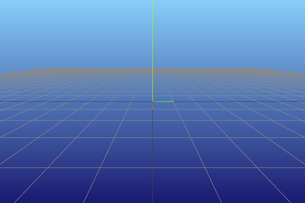
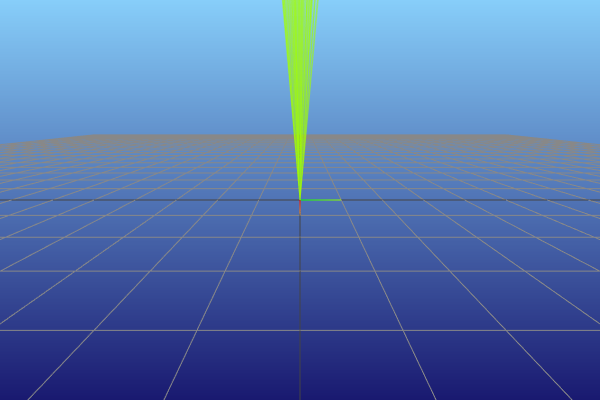
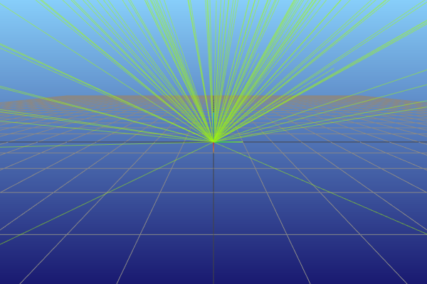
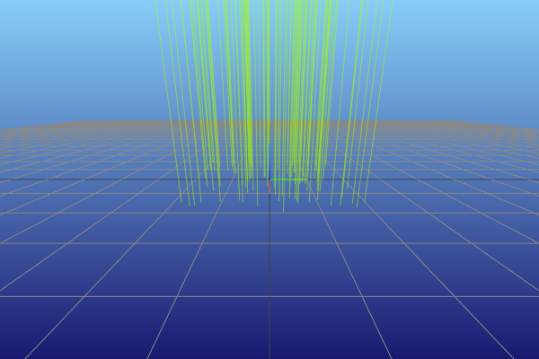
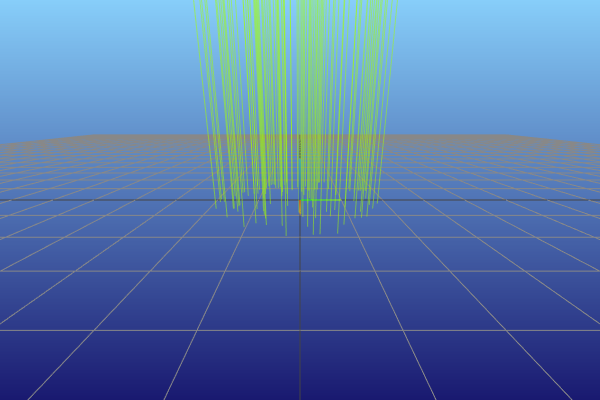
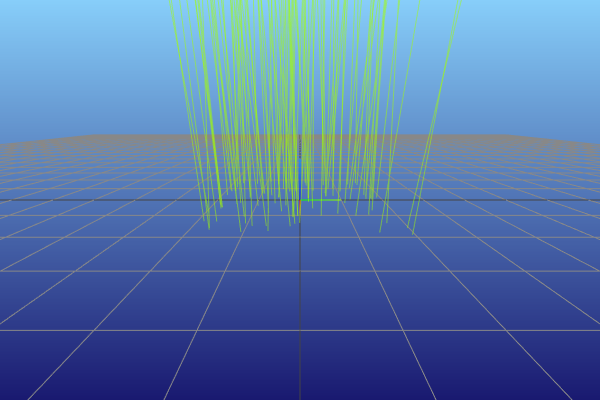
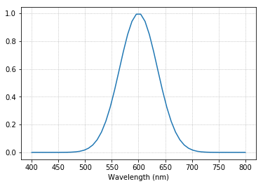
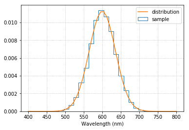
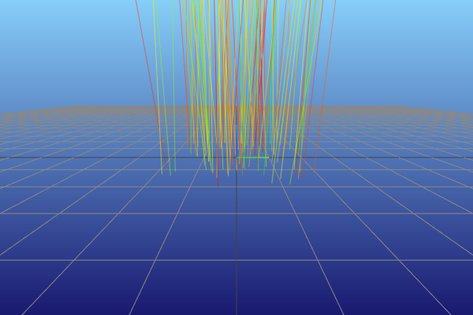

.. note::

    This is a static HTML version of an interactive Jupyter notebook in the examples folders of the pvtrace project.

Lights
======

In this notebook we will demonstrate how to automate the generation of
input rays using light sources. To make things simpler we will remove
the sphere and have an empty scene.

Subclassing to specialise a light source seems like the wrong approach,
as to account for all the possible options a large number of subclasses
would be needed. In pvtrace 2.0 we use delegation to customise
properties of the emitted rays.

.. code:: ipython3

    world = Node(
        name="world (air)",
        geometry=Sphere(
            radius=10.0,
            material=Dielectric.air()
        )
    )
    ray = Ray(
        position=(-1.0, 0.0, 0.9),
        direction=(1.0, 0.0, 0.0),
        wavelength=600.0
    )
    scene = Scene(world)
    tracer = PhotonTracer(scene)

Default Light
-------------

Make a default light object with no arguments.

The default light object generates rays with wavelength 555nm with
direction along the positive z-axis. Lights always emit from (0, 0, 0).
We will see later how to orientate lights into different positions.

.. code:: ipython3

    light = Light()
    vis = MeshcatRenderer()
    vis.render(scene)
    for ray in light.emit(10):
        path = tracer.follow(ray)
        vis.add_ray_path(path)
    vis.vis.jupyter_cell()

.. parsed-literal::

    You can open the visualizer by visiting the following URL:
    http://127.0.0.1:7009/static/

Light with divergence (solid angle)
-----------------------------------

All that is needed is to supply a function (a delegate) which alters one
of the three basic properties of a ray: position, direction and
wavelength.

The light object is initalised with a divergence delegate, which is a
callable, that does not take any arguments. When called, it provides
(:math:`\theta`, :math:`\phi`) divergence angles, which are specified as
offsets from the (0, 0, 1) direction. Clear as mud? Let’s see an
example.

.. code:: ipython3

    light = Light(divergence_delegate=functools.partial(Light.cone_divergence, np.radians(5)))
    vis = MeshcatRenderer()
    vis.render(scene)
    for ray in light.emit(100):
        path = tracer.follow(ray)
        vis.add_ray_path(path)
    vis.vis.jupyter_cell()

.. parsed-literal::

    You can open the visualizer by visiting the following URL:
    http://127.0.0.1:7010/static/

Here the line,

::

   functools.partial(Light.cone_divergence, np.radians(5))

uses functool.partial to return a function which when called samples
random directions inside a cone of solid angle with half-angle of
5-degrees from the normal direction.

Light with Lambertian distribution
----------------------------------

To emit light with a Lambertian distribution of angles, use the
divergence delegate ``Light.lambertian_divergence``.

.. code:: ipython3

    light = Light(divergence_delegate=Light.lambertian_divergence)
    vis = MeshcatRenderer()
    vis.render(scene)
    for ray in light.emit(100):
        path = tracer.follow(ray)
        vis.add_ray_path(path)
    vis.vis.jupyter_cell()

.. parsed-literal::

    You can open the visualizer by visiting the following URL:
    http://127.0.0.1:7011/static/

Light emitted from a square
---------------------------

A spatial mask can be provided using the position delegate, which
offsets the emission position in the xy-plane for each generated ray. To
emit inside the bounds of a square using the square mask delegate.

.. code:: ipython3

    # Square emitter
    xside, yside = (1, 1)
    light = Light(position_delegate=functools.partial(Light.square_mask, xside, yside))
    vis = MeshcatRenderer()
    vis.render(scene)
    for ray in light.emit(100):
        path = tracer.follow(ray)
        vis.add_ray_path(path)
    vis.vis.jupyter_cell()

.. parsed-literal::

    You can open the visualizer by visiting the following URL:
    http://127.0.0.1:7012/static/

Light emitted from a circle
---------------------------

Provide a circular mask to emit from a circle in the xy-plane.

.. code:: ipython3

    # Square emitter
    radius = 1
    light = Light(position_delegate=functools.partial(Light.circular_mask, radius))
    vis = MeshcatRenderer()
    vis.render(scene)
    for ray in light.emit(100):
        path = tracer.follow(ray)
        vis.add_ray_path(path)
    vis.vis.jupyter_cell()

.. parsed-literal::

    You can open the visualizer by visiting the following URL:
    http://127.0.0.1:7013/static/

Any combination of position and divergence
------------------------------------------

The power of the delegate approach is that, the angular and position
delegates are independent, meaning that any combination is allowed and
trivial to configure. In the example below we have used a cone
divergence with a square mask,

.. code:: ipython3

    # Square emitter
    radius = 1
    light = Light(
        divergence_delegate=functools.partial(Light.cone_divergence, np.radians(5)),
        position_delegate=functools.partial(Light.square_mask, xside, yside)
    )
    vis = MeshcatRenderer()
    vis.render(scene)
    for ray in light.emit(100):
        path = tracer.follow(ray)
        vis.add_ray_path(path)
    vis.vis.jupyter_cell()

.. parsed-literal::

    You can open the visualizer by visiting the following URL:
    http://127.0.0.1:7014/static/

Emitting rays from a spectrum
-----------------------------

Light also has a wavelength delegate which can be used set the
wavelength of the generated ray. Spectra are very problem specific so
pvtrace does not provide any builtin options. In this example, we
demonstrate how to construct and sample from your own distributions.

Let’s make an emission spectrum based on a Gaussian centred at 600nm. If
you have experimental data you could import it as x, y column and use
that instead.

.. code:: ipython3

    def make_emission_spectrum(wavelengths):
        return np.exp(-((wavelengths-600.0)/50.0)**2)
    x = np.linspace(400, 800)
    y = np.exp(-((x-600.0)/50.0)**2)
    plt.plot(x, y)
    plt.xlabel('Wavelength (nm)')
    plt.grid(linestyle='dotted')

pvtrace provides the ``Distribution`` object which aids in monte-carlo
sampling of spectral distributions.

.. code:: ipython3

    dist = Distribution(x, y)
    dist.sample(np.random.uniform())
    light = Light(
        wavelength_delegate=lambda: dist.sample(np.random.uniform())
    )

Emit 10000 rays and plot a histogram of the distribution of wavelengths.

.. code:: ipython3

    plt.hist([x.wavelength for x in list(light.emit(10000))], bins=20, density=True, histtype='step', label='sample')
    plt.plot(x, y/np.trapz(y, x), label='distribution')
    plt.legend()
    plt.xlabel("Wavelength (nm)")
    plt.grid(linestyle='dotted')

In the final example, we create a light with cone divergence, emitting
from a circle with the emission spectrum used above.

.. code:: ipython3

    # Square emitter
    radius = 1
    light = Light(
        wavelength_delegate=lambda: dist.sample(np.random.uniform()),
        divergence_delegate=functools.partial(Light.cone_divergence, np.radians(5)),
        position_delegate=functools.partial(Light.square_mask, xside, yside)
    )
    vis = MeshcatRenderer()
    vis.render(scene)
    for ray in light.emit(100):
        path = tracer.follow(ray)
        vis.add_ray_path(path)
    vis.vis.jupyter_cell()

.. parsed-literal::

    You can open the visualizer by visiting the following URL:
    http://127.0.0.1:7015/static/

In the next tutorial we look at how to position lights (and other
objects) in the scene at a location and orientation of your choosing.
