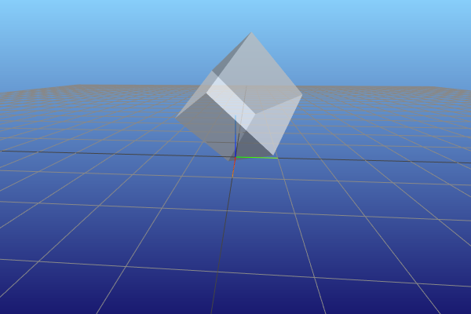
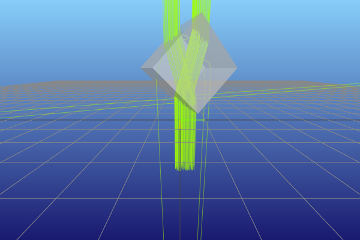
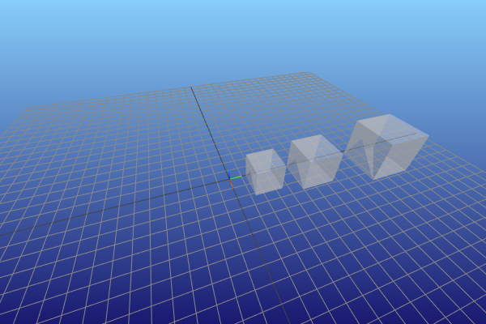

.. note::

    This is a static HTML version of an interactive Jupyter notebook in the examples folders of the pvtrace project.

Nodes
=====

In this notebook we introduce the concept of nodes.

We have been using nodes already as the things to which we are attaching
geometries. However, nodes are much more powerful than this and enabling
the placement an geometries and lights in the scene at an arbitrary
location and orientation. As we will see a bit later, nodes can be
nested too. So if you have a complicated scene you can apply a
transformation to the parent node which will have the effect of
transforming the whole subtree.

Clear as mud? Let’s begin.

We return to our usual scene and replace the sphere with a box geometry
because otherwise we could not be able to see the results of rotation
transformations.

.. code:: ipython3

    world = Node(
        name="world (air)",
        geometry=Sphere(
            radius=10.0,
            material=Dielectric.air()
        )
    )
    box = Node(
        name="box (glass)",
        geometry=Box(
            size=(1,1,1),
            material=Dielectric.glass()
        ),
        parent=world
    )
    scene = Scene(world)
    vis = MeshcatRenderer()
    vis.render(scene)

Add some widgets for changing the box’s location. The sliders change the
location tuple of the box node.

.. code:: ipython3

    from ipywidgets import interact, interactive, fixed, interact_manual
    import ipywidgets as widgets
    
    
    def update_box_position(x, y, z):
        box.location = (x, y, z)
        vis.update_transform(box)
    
    
    interact(
        update_box_position,
        x=widgets.FloatSlider(min=-5,max=5,step=0.1,value=0),
        y=widgets.FloatSlider(min=-5,max=5,step=0.1,value=0),
        z=widgets.FloatSlider(min=-5,max=5,step=0.1,value=0),
    )
    vis.vis.jupyter_cell()

Set location in scene
---------------------

The above sliders are using the box ``location`` property to set the
location of the box in the scene. Here we also need to call the
visualisers ``update_transform`` method to tell it about the change.

.. code:: ipython3

    box.location = (-2, 0.0, 0.5)
    vis.update_transform(box)  # tell the renderer is need to re-draw

Update rotation in scene
------------------------

Use the box ``rotate(angle, axis)`` method to *increment* the nodes
rotation, this transformation is applied to node’s current orientation.
Here the rotation the box 45-deg around the z-axis.

.. code:: ipython3

    box.rotate(np.radians(20), (0, 0, 1))
    vis.update_transform(box)

Thus you can undo the rotation like so,

.. code:: ipython3

    box.rotate(np.radians(-20), (0, 0, 1))
    vis.update_transform(box)

A fun animation
---------------

Let’s use the above node properties to animate the box (see visualiser
above).

.. code:: ipython3

    start = list(box.location)
    for idx in range(1000):
        time.sleep(0.01)
        box.rotate(np.radians(1.0), norm((0, 1, 1)))
        start[0] = np.sin((start[0] + idx)/100)
        box.location = tuple(start)
        vis.update_transform(box)

Scene with light node and geometry node
---------------------------------------

In the scene below we demonstrate placing a geometry object and a light
object in the scene using nodes. The light is attached to a node and the
node position and orientation is alterered to change the emission
direction. From the persective of the light source, it is still firing
rays along it’s z-axis of the node, but the node orienation relative to
the world node has changed.

.. code:: ipython3

    world = Node(
        name="world (air)",
        geometry=Sphere(
            radius=10.0,
            material=Dielectric.air()
        )
    )
    box = Node(
        name="box (glass)",
        geometry=Box(
            size=(1,1,1),
            material=Dielectric.glass()
        ),
        parent=world
    )
    laser = Node(
        name="light (555nm laser)",
        light=Light(position_delegate=functools.partial(Light.square_mask, 0.2, 0.2)),
        parent=world
    )
    # Customise location and orientation of the box
    box.location = (0.1, 0.1, 1.0)
    box.rotate(-np.pi/4, (1, 0, 0))
    box.rotate(np.pi/8, (0, 0, 1))
    # Change the location of the laser node
    laser.location = (0.1, 0.1, -1)
    scene = Scene(world)
    vis = MeshcatRenderer()
    vis.render(scene)
    vis.vis.jupyter_cell()

Notice that we use the laser *nodes* emit method and not the light’s
emit method. The light’s emit method will generate rays in the local
frame of the light, but we need the rays in the frame of the laser node.

.. code:: ipython3

    for ray in laser.emit(200):
        steps = photon_tracer.follow(ray, scene)
        path, decisions = zip(*steps)
        vis.add_ray_path(path)

Nested nodes
------------

Zoom out the visualiser below to see all three nodes.

Nodes can be nested. Let’s make make a few boxes and add them to a node
called *group*. Note that the group node does not have a geometry or
light attached - this is fine! We will then rotate the group node to
rotate all of them at the same time.

.. code:: ipython3

    world = Node(
        name="world (air)",
        geometry=Sphere(
            radius=10.0,
            material=Dielectric.air()
        )
    )
    group = Node(
        name="group",
        parent=world
    )
    box1 = Node(
        name="box 1(glass)",
        geometry=Box(
            size=(1,1,1),
            material=Dielectric.glass()
        ),
        parent=group
    )
    box2 = Node(
        name="box 2 (glass)",
        geometry=Box(
            size=(1,1,1),
            material=Dielectric.glass()
        ),
        parent=group
    )
    box3 = Node(
        name="box 3 (glass)",
        geometry=Box(
            size=(1,1,1),
            material=Dielectric.glass()
        ),
        parent=group
    )

    # Customise location and orientation
    box1.location = (1, 1, 1)
    box2.location = (2, 2, 2)
    box3.location = (3, 3, 3)
    scene = Scene(world)
    vis = MeshcatRenderer()
    vis.render(scene)
    vis.vis.jupyter_cell()

Spin the whole group node around the z-axis to change all node positions
at once.

.. code:: ipython3

    steps = 200.0
    phi_range = 4 * np.pi
    phi_increment = phi_range / steps
    for _ in range(int(steps)):
        time.sleep(0.05)
        group.rotate(phi_increment, norm((0, 0, 1)))
        vis.update_transform(group)
