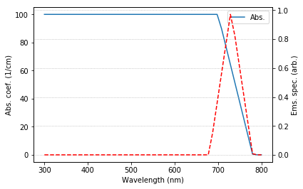
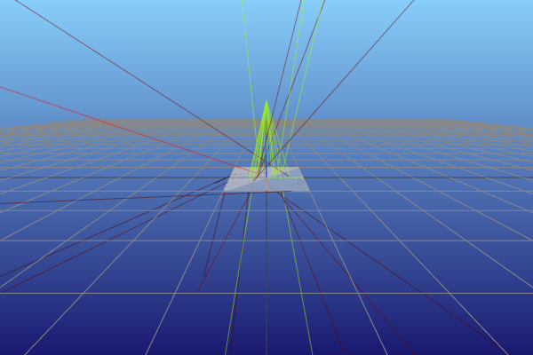
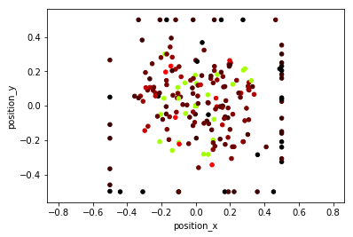

.. code:: ipython3

    import numpy as np
    import pathlib
    import time
    import sys
    import os
    import matplotlib
    import pandas as pd
    from dataclasses import asdict
    import matplotlib
    import matplotlib.pyplot as plt
    %matplotlib inline
    import functools
    from pvtrace.light.utils import wavelength_to_rgb
    from pvtrace.scene.scene import Scene
    from pvtrace.trace.tracer import PhotonTracer
    from pvtrace.scene.node import Node
    from pvtrace.scene.node import Node
    from pvtrace.common.errors import TraceError
    from pvtrace.light.light import Light
    from pvtrace.light.ray import Ray
    from pvtrace.geometry.mesh import Mesh
    from pvtrace.geometry.box import Box
    from pvtrace.geometry.sphere import Sphere
    from pvtrace.material.material import Dielectric, LossyDielectric, Lumophore, Host
    from pvtrace.scene.node import Node
    from pvtrace.scene.renderer import MeshcatRenderer
    from pvtrace.geometry.utils import magnitude
    import logging
    # We want to see pvtrace logging here
    logging.getLogger('pvtrace').setLevel(logging.ERROR)

Luminescent solar concentrator
==============================

In this example we perform a simulation of a box shape luminescent
concentrator (LSC) and demonstrate how the data can be analysed and
plotted.

Absorption and emission spectrum
--------------------------------

Let’s make a dye with an absorption coefficient (1/cm) and an emission
spectrum. In a real simulation you will want to use measured data for
this properties.

.. code:: ipython3

    def make_absorprtion_coefficient(wavelengths, absorption_coefficient, cutoff_range, min_alpha=0):
        wavelength1, wavelength2 = cutoff_range
        alpha = absorption_coefficient
        halfway = wavelength1 + 0.5 * (wavelength2 - wavelength1)
        x = [0.0, wavelength1, halfway, wavelength2, sys.float_info.max]
        y = [alpha, alpha, 0.5 * alpha, min_alpha, min_alpha]
        abs_coeff = np.interp(wavelengths, x, y)
        return abs_coeff
    
    def make_emission_spectrum(wavelengths, cutoff_range, min_ems=0):
        wavelength1, wavelength2 = cutoff_range
        halfway = wavelength1 + 0.5 * (wavelength2 - wavelength1)
        x = [0.0, wavelength1, halfway, wavelength2, sys.float_info.max]
        y = [min_ems, min_ems, 1.0, min_ems, min_ems]
        abs_coeff = np.interp(wavelengths, x, y)
        return abs_coeff
    
    wavelength_range = (300, 800)
    wavelength = np.linspace(*wavelength_range)
    abs_coef = make_absorprtion_coefficient(wavelength, 100.0, (700, 780))
    ems_spec = make_emission_spectrum(wavelength, (680, 780))
    fig, ax1 = plt.subplots()
    ax1.plot(wavelength, abs_coef, label="Abs.")
    ax1.set_ylabel('Abs. coef. (1/cm)')
    ax2 = ax1.twinx()
    ax2.plot(wavelength, ems_spec, '--r', label="Ems.")
    ax2.set_ylabel('Ems. spec. (arb.)')
    ax1.set_xlabel('Wavelength (nm)')
    plt.grid(linestyle='dotted')
    ax1.legend()

We need to provide this data to pvtrace in a pandas dataframe with a
very specific format as shown below,

.. code:: ipython3

    data = {
        "wavelength": wavelength,
        "refractive index": np.ones(wavelength.shape) * 1.5,
        "absorption coefficient dye 1": abs_coef,
        "emission spectrum dye 1": ems_spec,
        "quantum yield dye 1": np.ones(wavelength.shape) * 1.0
    }    
    df = pd.DataFrame(data)
    df.tail()

.. raw:: html

    

    
    <table border="1" class="dataframe">
      <thead>
        <tr style="text-align: right;">
          <th></th>
          <th>wavelength</th>
          <th>refractive index</th>
          <th>absorption coefficient dye 1</th>
          <th>emission spectrum dye 1</th>
          <th>quantum yield dye 1</th>
        </tr>
      </thead>
      <tbody>
        <tr>
          <th>45</th>
          <td>759.183673</td>
          <td>1.5</td>
          <td>26.020408</td>
          <td>0.416327</td>
          <td>1.0</td>
        </tr>
        <tr>
          <th>46</th>
          <td>769.387755</td>
          <td>1.5</td>
          <td>13.265306</td>
          <td>0.212245</td>
          <td>1.0</td>
        </tr>
        <tr>
          <th>47</th>
          <td>779.591837</td>
          <td>1.5</td>
          <td>0.510204</td>
          <td>0.008163</td>
          <td>1.0</td>
        </tr>
        <tr>
          <th>48</th>
          <td>789.795918</td>
          <td>1.5</td>
          <td>0.000000</td>
          <td>0.000000</td>
          <td>1.0</td>
        </tr>
        <tr>
          <th>49</th>
          <td>800.000000</td>
          <td>1.5</td>
          <td>0.000000</td>
          <td>0.000000</td>
          <td>1.0</td>
        </tr>
      </tbody>
    </table>
    

LSC scene
---------

Let’s make our scene. If you have followed the tutorials 001 to 004 all
of the following should make sense,

.. code:: ipython3

    # Make a world coordinate system
    world_node = Node(name='world')
    world_node.geometry = Sphere(radius=10.0, material=Dielectric.make_constant((300, 1000.0), 1.0))
    
    # Add LSC
    size = (1.0, 1.0, 0.02)
    lsc = Node(name="LSC", parent=world_node)
    lsc.geometry = Box(size, material=Host.from_dataframe(df))
    
    # Light source
    light = Light(divergence_delegate=functools.partial(Light.cone_divergence, np.radians(20)))
    light_node = Node(name='light', parent=world_node, location=(0.0, 0.0, 1.0))
    light_node.rotate(np.radians(180), (1, 0, 0))
    light_node.light = light
    scene = Scene(root=world_node)

.. code:: ipython3

    renderer = MeshcatRenderer(max_histories=None)
    renderer.render(scene)
    renderer.vis.jupyter_cell()

.. parsed-literal::

    You can open the visualizer by visiting the following URL:
    http://127.0.0.1:7019/static/

Let’s trace a small number of rays to see if we made our scene
correctly.

.. code:: ipython3

    tracer = PhotonTracer(scene)
    for light_node in scene.light_nodes:
        for ray in light.emit(20):
            ray = ray.representation(light_node, world_node)
            history = tracer.follow(ray)
            path = [x for x in history]
            renderer.add_ray_path(path)

Tracing
-------

The scene looks good, we have a divergent light source with wavelength
555nm hitting the top surface and luminescent rays are exiting the LSC
surface.

Let’s trace a larger number of rays to make a dataset we can analyse.

.. code:: ipython3

    from ipywidgets import IntProgress
    from IPython.display import display
    np.random.seed(4)
    tracer = PhotonTracer(scene)
    entrance_rays = []
    exit_rays = []
    max_rays = 200
    f = IntProgress(min=0, max=max_rays, description='Tracing:',
    )
    display(f)
    for light_node in scene.light_nodes:
        for idx, ray in enumerate(light.emit(max_rays)):
            ray = ray.representation(light_node, world_node)
            try:
                path = tracer.follow(ray)
            except TraceError:
                continue
            else:
                entrance_rays.append(path[0])
                exit_rays.append(path[-2])  # -1 is the world node, don't want that
            finally:
                f.value += 1
    print("Done!")

.. parsed-literal::

    IntProgress(value=0, description='Tracing:', max=200)

.. parsed-literal::

    Done!

Here are some helper functions for labelling and processing the row and
columns.

.. code:: ipython3

    def expand_coords(df, column):
        """ Returns a dataframe with coordinate column expanded into components.
        
            Parameters
            ----------
            df : pandas.DataFrame
                The dataframe
            column : str
                The column label
            
            Returns
            -------
            df : pandas.DataFrame
                The dataframe with the column expanded.
            
            Example
            -------
            Given the dataframe::
            
                df = pd.DataFrame({'position': [(1,2,3)]})
            
            the function will return a new dataframe::
            
                edf = expand_coords(df, 'position')
                edf == pd.DataFrame({'position_x': [1], 'position_y': [2], 'position_z': [3]})
            
        """
        coords = np.stack(df[column].values)
        df['{}_x'.format(column)] = coords[:, 0]
        df['{}_y'.format(column)] = coords[:, 1]
        df['{}_z'.format(column)] = coords[:, 2]
        df.drop(columns=column, inplace=True)
        return df
    
    def label_facets(df, length, width, height):
        """ Label rows with facet names for a box LSC.
        
            Notes
            -----
            This function only works if the coordinates in the dataframe
            are in the local frame of the box. If the coordinates are in the
            world frame then this will still work provided the box is axis
            aligned with the world node and centred at the origin.
        """
        xmin, xmax = -0.5*length, 0.5*length
        ymin, ymax = -0.5*width, 0.5*width
        zmin, zmax = -0.5*height, 0.5*height
        df.loc[(np.isclose(df['position_x'], xmin)), 'facet'] = '-x'
        df.loc[(np.isclose(df['position_x'], xmax)), 'facet'] = '+x'
        df.loc[(np.isclose(df['position_y'], ymin)), 'facet'] = '-y'
        df.loc[(np.isclose(df['position_y'], ymax)), 'facet'] = '+y'
        df.loc[(np.isclose(df['position_z'], zmin)), 'facet'] = '-z'
        df.loc[(np.isclose(df['position_z'], zmax)), 'facet'] = '+z'
        return df
    

Let’s investigate the entrance and exit rays.

.. code:: ipython3

    df = pd.DataFrame()
    
    # Rays entering the scene
    for ray in entrance_rays:
        rep = asdict(ray)
        rep['kind'] = 'entrance'
        df = df.append(rep, ignore_index=True)
        
    # Rays exiting the scene
    for ray in exit_rays:
        rep = asdict(ray)
        rep['kind'] = 'exit'
        df = df.append(rep, ignore_index=True)
        
    # Expand position and direction columns into component columns
    df = expand_coords(df, 'direction')
    df = expand_coords(df, 'position')
    
    # Label facets
    df = label_facets(df, *size)
    df.head()

.. raw:: html

    

    
    <table border="1" class="dataframe">
      <thead>
        <tr style="text-align: right;">
          <th></th>
          <th>is_alive</th>
          <th>kind</th>
          <th>wavelength</th>
          <th>direction_x</th>
          <th>direction_y</th>
          <th>direction_z</th>
          <th>position_x</th>
          <th>position_y</th>
          <th>position_z</th>
          <th>facet</th>
        </tr>
      </thead>
      <tbody>
        <tr>
          <th>0</th>
          <td>1.0</td>
          <td>entrance</td>
          <td>555.0</td>
          <td>0.227126</td>
          <td>0.047736</td>
          <td>-0.972695</td>
          <td>0.0</td>
          <td>0.0</td>
          <td>1.0</td>
          <td>NaN</td>
        </tr>
        <tr>
          <th>1</th>
          <td>1.0</td>
          <td>entrance</td>
          <td>555.0</td>
          <td>0.249028</td>
          <td>0.069553</td>
          <td>-0.965995</td>
          <td>0.0</td>
          <td>0.0</td>
          <td>1.0</td>
          <td>NaN</td>
        </tr>
        <tr>
          <th>2</th>
          <td>1.0</td>
          <td>entrance</td>
          <td>555.0</td>
          <td>-0.012284</td>
          <td>0.111872</td>
          <td>-0.993647</td>
          <td>0.0</td>
          <td>0.0</td>
          <td>1.0</td>
          <td>NaN</td>
        </tr>
        <tr>
          <th>3</th>
          <td>1.0</td>
          <td>entrance</td>
          <td>555.0</td>
          <td>-0.006309</td>
          <td>0.074203</td>
          <td>-0.997223</td>
          <td>0.0</td>
          <td>0.0</td>
          <td>1.0</td>
          <td>NaN</td>
        </tr>
        <tr>
          <th>4</th>
          <td>1.0</td>
          <td>entrance</td>
          <td>555.0</td>
          <td>-0.078255</td>
          <td>-0.011462</td>
          <td>-0.996868</td>
          <td>0.0</td>
          <td>0.0</td>
          <td>1.0</td>
          <td>NaN</td>
        </tr>
      </tbody>
    </table>
    

Spatial distribution of photons
-------------------------------

Let’s view all rays locations in the xy-plane

.. code:: ipython3

    def xy_plot(df):
        """ Plots ray positions in the xy-plane.
            
            References
            ----------
            [1] https://stackoverflow.com/questions/44959955/matplotlib-color-under-curve-based-on-spectral-color
        """
        norm = plt.Normalize(*wavelength_range)
        wl = np.arange(wavelength_range[0], wavelength_range[1]+1,2)
        colorlist = list(zip(norm(wl), [np.array(wavelength_to_rgb(w))/255 for w in wl]))
        spectralmap = matplotlib.colors.LinearSegmentedColormap.from_list("spectrum", colorlist)
        colors = [spectralmap(norm(value)) for value in df['wavelength']]
        df.plot(x='position_x', y='position_y', kind='scatter', alpha=1.0, color=colors)
        plt.axis('equal')
    xy_plot(df)

We can see the green rays entering the top surface. Rays near the centre
are redshifted from green to red because they have only travelled a
short distance and have not encounter many reabsorption event. The image
also shows luminescent photons clustering on the edges. These are deep
red colour because they have been red shifted the most due to a large
path length in the material.

Optical efficiency
------------------

We need more rays to calculate the optical efficiency per surface, but
you could do it like this.

.. code:: ipython3

    counts = dict()
    counts['-x'] = df.loc[(df['kind']=='exit')&(df['facet']=='-x')].shape[0]
    counts['+x'] = df.loc[(df['kind']=='exit')&(df['facet']=='+x')].shape[0]
    counts['-y'] = df.loc[(df['kind']=='exit')&(df['facet']=='-y')].shape[0]
    counts['+y'] = df.loc[(df['kind']=='exit')&(df['facet']=='+y')].shape[0]
    counts['-z'] = df.loc[(df['kind']=='exit')&(df['facet']=='-z')].shape[0]
    counts['+z'] = df.loc[(df['kind']=='exit')&(df['facet']=='+z')].shape[0]
    counts

.. parsed-literal::

    {'-x': 7, '+x': 17, '-y': 9, '+y': 9, '-z': 78, '+z': 80}

.. code:: ipython3

    etaopt = dict()
    thrown = df[df['kind']=='entrance'].size
    for facet in counts:
        etaopt[facet] = counts[facet]/thrown
    etaopt

.. parsed-literal::

    {'-x': 0.0035,
     '+x': 0.0085,
     '-y': 0.0045,
     '+y': 0.0045,
     '-z': 0.039,
     '+z': 0.04}

Aggregate the edge surfaces as these facets are where you might want to
place your solar cells.

.. code:: ipython3

    etaopt['-x'] + etaopt['+x'] + etaopt['-y'] + etaopt['+y']

.. parsed-literal::

    0.021

