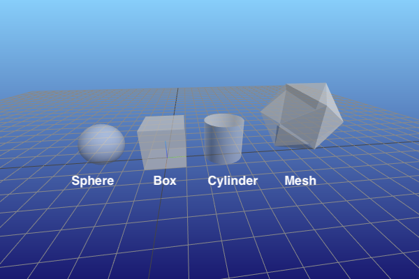

Geometry
========

This notebook demonstrates the different geometry objects available in
pvtrace.

Sphere
------

A sphere defined by a radius.

Cylinder
--------

A cylinder with end caps defined by a radius and a length.

Box
---

A box defined by length of the sides.

Mesh
----

Any arbitrary mesh can be loaded into pvtrace and traced. However the
mesh must be closed for the ray tracing algorithms to work.

.. code:: ipython3

    from pvtrace.scene.node import Node
    from pvtrace.geometry.sphere import Sphere
    from pvtrace.geometry.cylinder import Cylinder
    from pvtrace.geometry.box import Box
    from pvtrace.geometry.mesh import Mesh
    from pvtrace.scene.scene import Scene
    from pvtrace.scene.renderer import MeshcatRenderer
    import trimesh
    
    # always need a world node
    world = Node(
        name="world",
        geometry=Sphere(
            radius=100.0
        ),
    )
    
    # Sphere
    sphere = Node(
        name="sphere",
        geometry=Sphere(
            radius=0.5
        ),
        parent=world
    )
    sphere.translate((0.0, -1.5, 0.5))
    
    # Box
    box = Node(
        name="box",
        geometry=Box(
            (1.0, 1.0, 1.0)
        ),
        parent=world
    )
    box.translate((0.0, 0.0, 0.5))
    
    # Cylinder
    cylinder = Node(
        name="cylinder",
        geometry=Cylinder(
            1.0, 0.5
        ),
        parent=world
    )
    cylinder.translate((0.0, 1.5, 0.5))
    
    # Mesh
    mesh = Node(
        name="mesh (icosahedron)",
        geometry=Mesh(
            trimesh=trimesh.creation.icosahedron()
        ),
        parent=world
    )
    mesh.translate((0.0, 3.5, 1.0))
    scene = Scene(world)
    vis = MeshcatRenderer()
    vis.render(scene)
    try:
        vis.vis.jupyter_cell()
    except Exception:
        pass

