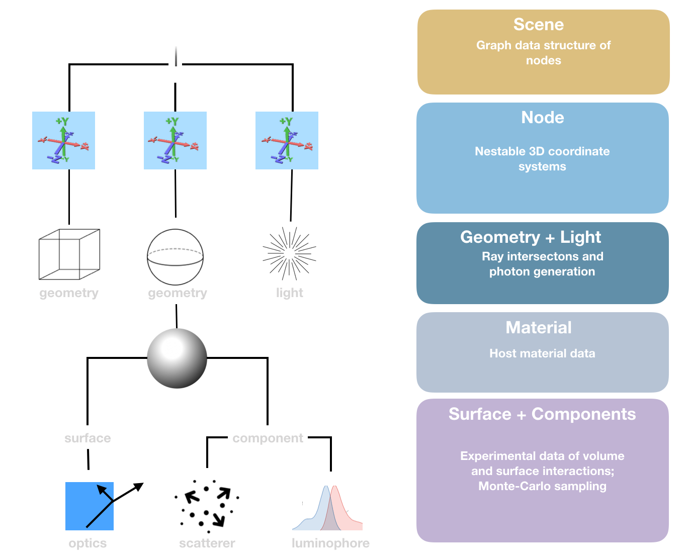

Design
------

This section is intended of readers who are interested in software architectures.

`pvtrace` uses nested data structures which enable huge versatility and easy to read code. The hierarchy is shown below.

At the top exists the `scene` and `node`s. A scene is a graph of coordinate system which are defined relative to a parent that are called `nodes`. The scene provides useful functionality, for example, it can return intersections with all child nodes even if child nodes are nested and have arbitrary translations and rotations transformations applied.

A node can be assigned a *single* `geometry`. This could be a primitive like a `sphere`, `cube`, or `cylinder` or a much complicated shape imported from a `mesh`. These objects return intersection points with rays and perform surface normal calculations which are needed for physically valid path tracing.

The data structures now move away from coordinate system and geometry, to objects which represent physical properties of materials. The `material` can be thought of a host or bulk material such as air, plastic, glass, semiconductor, which has a refractive index. At this level, `pvtrace` is quite useful for non-imaging optics simulations.

However, real materials also attenuate, scatter and possibly reemit light by luminescence, these processes can occur either at surfaces or within the volume. `pvtrace` allows a material to be assigned a `surface` and multiple `components` such as `scatterers`, `absorbers` and `luminophores`.

The surface object performs automatic Fresnel reflection and refraction at interfaces but also has a powerful plugin (or delegate) system that enables these interactions to be fully customised. For example, to simulate surface coatings that have wavelength, angle or spacial dependence. 

Multiple `components` can be added to simulate materials properties such as volume scattering, absorption, and emission. This is particularly useful for performing simulations of luminescent concentrators or other luminescent materials.

