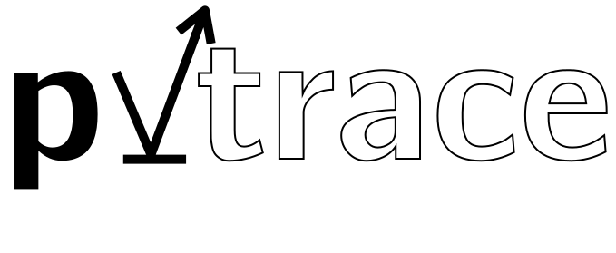

pvtrace
=======

Optical ray tracing for luminescent materials and spectral converter photovoltaic devices.

Install
-------

Using pip::

    pip install pvtrace

Introduction
------------

pvtrace is a statistical photon path tracer written in Python. It follows photons through a 3D scene and records their interactions with objects to build up statistical information about energy flow. This approach is particularly useful in photovoltaics and non-imaging optics where the goal is to design systems which efficiently transport light to target locations.

pvtrace was originally written to characterise the performance of Luminescent Solar Concentrators (LSC) and takes a Monte-Carlo approach to ray-tracing. Each ray is independent and can interact with objects in the scene via reflection and refraction. Objects can have different optical properties: refractive index, absorption coefficient, emission spectrum and quantum yield.

One of the key features of pvtrace is the ability to simulate re-absorption of photons in luminescent materials. Moreover, pvtrace's architecture places emphasis on following individual photons as they interact with multiple luminescent absorbers. 

However, it may also be useful to researches or designers interesting in ray-optics simulations but will be slower at running these simulations compared to other software packages because pvtrace follows each ray individually.

.. image:: example.png
    :width: 470px
    :alt: Tracing a glass sphere
    :align: center
    
A minimal working example that traces a glass sphere::

    import time
    import sys
    import functools
    import numpy as np
    from pvtrace import *

    world = Node(
        name="world (air)",
        geometry=Sphere(
            radius=10.0,
            material=Material(refractive_index=1.0),
        )
    )

    sphere = Node(
        name="sphere (glass)",
        geometry=Sphere(
            radius=1.0,
            material=Material(refractive_index=1.5),
        ),
        parent=world
    )
    sphere.location = (0, 0, 2)

    light = Node(
        name="Light (555nm)",
        light=Light(direction=functools.partial(cone, np.pi/8)),
        parent=world
    )

    renderer = MeshcatRenderer(wireframe=True, open_browser=True)
    scene = Scene(world)
    renderer.render(scene)
    for ray in scene.emit(100):
        steps = photon_tracer.follow(scene, ray)
        path, events = zip(*steps)
        renderer.add_ray_path(path)
        time.sleep(0.1)

    # Wait for Ctrl-C to terminate the script; keep the window open
    print("Ctrl-C to close")
    while True:
        try:
            time.sleep(.3)
        except KeyboardInterrupt:
            sys.exit()

Examples
--------

Please see the download and try the Jupyter notebook interactive tutorials to learn more about pvtrace. These can be found in the 
`examples <https://github.com/danieljfarrell/pvtrace/tree/master/examples>`_ directory in the GitHub repository.

Architecture
------------

*pvtrace* is designed in layers each with as limited scope as possible.

.. image:: pvtrace-design.png
    :width: 600px
    :alt: Design overview
    :align: center

Scene
    Graph data structure of node and the thing that is ray-traced.

Node
    Provides a coordinate system, can be nested inside one another, perform arbitrary rotation and translation transformations.

Geometry/Light
    Attached to nodes to define different shapes (Sphere, Box, Cylinder, Mesh) and handles all ray intersections and generation.

Material
    Attached to geometry objects to assign physical properties to shapes such as refractive index.

Surface
    Handles details of interaction between material surfaces and a customisation point for simulation of wavelength selective coatings.

Component
    Specifies optical properties of the geometries volume, absorption coefficient, scattering coefficient, quantum yield, emission spectrum.

Dependancies
------------

* python >= 3.7.2
* trimesh (for mesh shapes)
* meshcat (for visualisation)
* numpy
* anytree

.. toctree::
   :maxdepth: 4
   :caption: Contents:

   info
   design
   _modules/modules

Indices and tables
==================

* :ref:`genindex`
* :ref:`modindex`
* :ref:`search`
