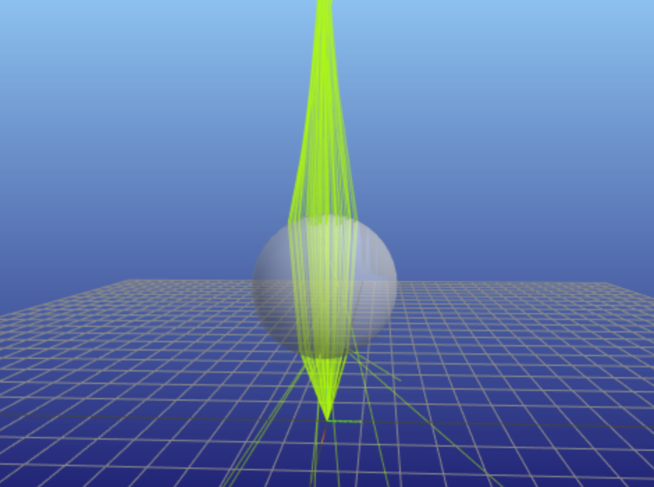

# pvtrace
> Optical ray tracing for luminescent materials and spectral converter photovoltaic devices


pvtrace is a raytracer for collecting statistics about energy flow in non-imagining optical systems where the primary goal is efficient transport of light to target locations.

One particular strength is the ability to simulate luminescent materials such as organic dyes and quantum dots used in Luminescent Solar Concentrators.

---

**Source code:** [https://github.com/danieljfarrell/pvtrace](https://github.com/danieljfarrell/pvtrace)

**Documentation:** [https://github.com/danieljfarrell/pvtrace](https://github.com/danieljfarrell/pvtrace)

---

## Example

Scenes can be described in Python or YAML.

=== "Python"

    ``` python
    from pvtrace import *
    import functools

    world = Node(
        name="world",
        geometry=Sphere(
            radius=10.0,
            material=Material(refractive_index=1.0),
        ),
    )

    ball_lens = Node(
        name="ball-lens",
        geometry=Sphere(
            radius=1.0,
            material=Material(refractive_index=1.5),
        ),
        parent=world,
    )
    ball_lens.location = (0, 0, 2)

    green_laser = Node(
        name="green-laser",
        light=Light(
            direction=functools.partial(cone, 22.5),
            name="green-laser"
        ),
        parent=world,
    )

    scene = Scene(world)
    ```

=== "YAML"

    ``` yaml
    # scene.yml

    version: "1.0"

    nodes:
      world:
        sphere:
          radius: 10.0
          material:
            refractive-index: 1.0

      ball-lens:
        location: [0, 0, 2]
        sphere:
          radius: 1.0
          material:
            refractive-index: 1.5

      green-laser:
        location: [0, 0, 0]
        light:
          mask:
            direction:
              cone:
                half-angle: 22.5
    ```

This scene contains three nodes:

- a world node must be large enough to contains all other object
- a ball-lens of refractive index 1.5 and radius 1
- a monochromatic light source diverging into a cone of solidangle

Run simulations in python or using the command line interface

=== "Python"

    ``` python
    result = scene.simulate(100)  # generate 100 rays
    ```

=== "CLI"

    ``` bash
    pvtrace-cli simulate --rays 100 scene.yml
    ```



The result is a full path history of all rays. This will be returned as a Python list or saved into a database file using the CLI.

Ray statistics can be extracted from the database file using the `count` command.

The number of rays reflected from the ball-lens,

``` py3
pvtrace-cli count reflected ball-lens tests/data/simple_box.sqlite3
```

and the number of rays entering,
``` py3
pvtrace-cli count entering ball-lens tests/data/simple_box.sqlite3
```

Read the user guide for more examples.

## Installation

pvtrace is written in Python but some of it's dependencies require C/C++ libraries to be installed on your system. For this reason please follow the instructions below for your operating system.

### macOS

The recommended way on macOS uses [homebrew](https://brew.sh) and [pyenv](https://github.com/pyenv/pyenv). Follow the links and install those tools.

Use the `brew` command to install spatialindex,

    brew install spatialindex

Next, create a clean virtual environment for pvtrace

    pyenv install 3.7.8
    pyenv virtualenv 3.7.8 pvtrace-env
    pyenv activate pvtrace-env
    pip install pvtrace

### Linux and Windows

On Linux and Windows [conda](https://docs.conda.io/projects/conda/en/latest/user-guide/install/) can be used to create python environment and also install C/C++ dependencies. Optionally, you can also use this method on MacOS too if you prefer conda over pyenv.

    conda create --name pvtrace-env python=3.7.8
    conda activate pvtrace-env
    conda install Rtree
    pip install pvtrace
