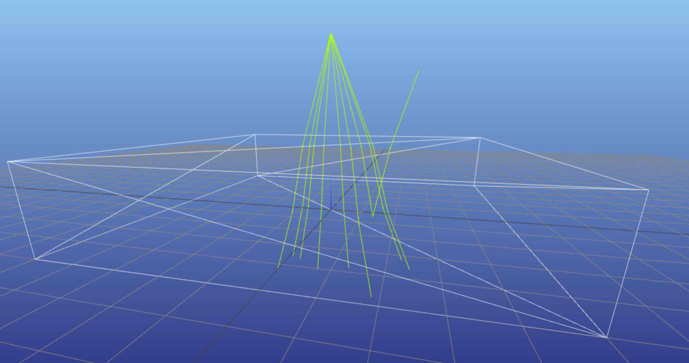
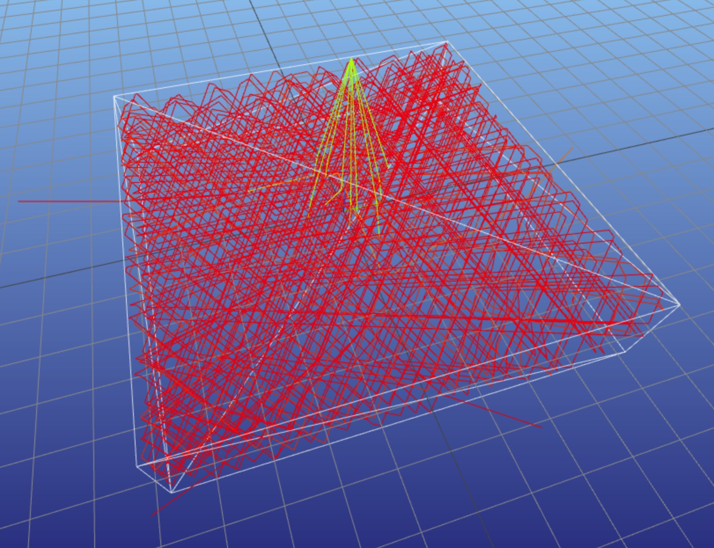

# LSC with Lumogen Red Dye

This example demonstrates how to simulate a Luminescent Solar Concentrator (LSC) using pvtrace. It covers,

- Writing a YAML file scene
- Adding an LSC waveguide
- Adding luminescent dye to the waveguide
- Using the CLI to:
    - Run simulations
    - Get ray statistics
    - Subtract killed rays
    - Calculate the optical efficiency

## Scene

Create an empty YAML file.

Add a version tag, this tells pvtrace how it should parse the file.

```YAML hl_lines="1"
{!lsc_lumogen_red_cli/tutorial001.yml!}
```

## World node


Create a `nodes:` object,

```YAML hl_lines="3"
{!lsc_lumogen_red_cli/tutorial001.yml!}
```

Add a sphere node called "world" with radius 100 to the list of nodes

!!! warning
    The world node must be sized large enough to contain all other nodes.


```YAML hl_lines="4-6"
{!lsc_lumogen_red_cli/tutorial001.yml!}
```

Assign the node a material with refractive index 1.0 (air). We will see later how to include other options under the material section.

```YAML hl_lines="7-8"
{!lsc_lumogen_red_cli/tutorial001.yml!}
```

## LSC node

Add a node with box geometry of length and width 5 and thicknesses 1.

```YAML hl_lines="10 12 13"
{!lsc_lumogen_red_cli/tutorial002.yml!}
```

Move the centre of the box to coordinate `[0, 0, 0.5]`. This is not strickly required but just means that the bottom surface is a `z=0`.

```YAML hl_lines="11"
{!lsc_lumogen_red_cli/tutorial002.yml!}
```

Add a material attribute with refractive index 1.5,

```YAML hl_lines="14-15"
{!lsc_lumogen_red_cli/tutorial002.yml!}
```

## Light source

!!! tip
    Direction are specified as Cartesian vectors with components: `[x, y, z]`. The length of the vector must be one.

Add another node called `green-laser`, put the location above the top surface of the LSC and set the direction vector so that it fires downwards into the top surface,

```YAML hl_lines="17-19"
{!lsc_lumogen_red_cli/tutorial003.yml!}
```

Specify this node as a `light` node and set the wavelength attribute, this is specified in nanometers.

!!! tip
    As a rule of thumb blue light is 450nm, green 555nm, and red 650nm

```YAML hl_lines="21"
{!lsc_lumogen_red_cli/tutorial003.yml!}
```

Add a direction mask: the highlighted lines request that the light source generates rays randomly inside a cone of solid angle with half-angle 22.5 degrees. This will make visualising the rays in this section easier because they will all take slightly different paths.

```YAML hl_lines="22-25"
{!lsc_lumogen_red_cli/tutorial003.yml!}
```


## Check scene

Before continuing with the script lets check that everything is OK by running a quick simulation using the command line interface.

In a new terminal window activate the pvtrace environment and start the Meshcat Server

```bash
meshcat-server
```

This will print two URLs which we will need for this section.

```bash
zmq_url=tcp://127.0.0.1:6000
web_url=http://127.0.0.1:7000/static/
```


In a new terminal window, activate the pvtrace environment and navigate to the folder containing your scene file. The following command will open the renderer and trace 10 rays.

Use the CLI's `simulate` command

```bash hl_lines="1"
{!lsc_lumogen_red_cli/tutorial004.sh!}
```

Set the number of rays to 10 and the number of workers to 1.

```bash hl_lines="2-3"
{!lsc_lumogen_red_cli/tutorial004.sh!}
```

!!! tip
    By default pvtrace-cli simulation use multiple processes. However, for _small_ number of rays setting `--workers 1` is faster due to overhead in starting the additional processes.

Use the Meshcat server ZMQ URL you found before and the commands below to ensure that all rays are visualised and held in the viewer

```bash hl_lines="4-6"
{!lsc_lumogen_red_cli/tutorial004.sh!}
```

!!! tip
    Rendering slows down tracing the `--render-every` option only visualises every n-th ray and `--render-max` is the number of rays to keep in the scene; old rays are removed.

Finally, supply the name of the YML file,

```bash hl_lines="7"
{!lsc_lumogen_red_cli/tutorial004.sh!}
```

Your default browser should open and display the scene with a 10 rays



## Dye component

!!! tip
    Components section should be added as the root level.

!!! tip
    Don't forget to include the component name in the _node's_ material's component list.
   
Add a new components section to the YML file and pick a name for the component, here we used `my-lumogen-dye`.

```yaml hl_lines="17-18 31-52"
{!lsc_lumogen_red_cli/tutorial005.yml!}
```

This specifies that the component is a luminophore; it can absorb and emit light,

```yaml hl_lines="33"
{!lsc_lumogen_red_cli/tutorial005.yml!}
```

!!! tip
    pvtrace has different types of components: absorbers, scatters, reactors and luminophores. Luminophores are the most complicated.

### Absorption coefficient

!!! tip
    pvtrace has absorption and emission spectrum of Lumogen F Red 305 builtin. If you need to specify your own absorption and emission spectrums then can be done by importing the data from CSV files. Please read one of the other tutorials on how to do this.

Add an absorption section. Let's go through these lines!

```yaml hl_lines="34-42"
{!lsc_lumogen_red_cli/tutorial005.yml!}
```

Let's say I have measured the absorption coefficient of my LSC containing Lumogen F Red 305 by looking at the light transmitted through the device and have determined it to be $\alpha=5~\text{cm}^{-1}$ at main absorption peak using the Beer-Lambert law,

$$ I = I_0 e^{-\alpha d} $$

where $d$ is the thickness of the layer.

!!! warning
    pvtrace uses base-$e$ rather than base-10 definition of absorption coefficient.

To express the peak absorption coefficient is $5~\text{cm}^{-1}$ set the `coefficient` attribute and to use builtin Lumogen F Red 305 spectrum set name attribute to `lumogen-f-red-305`.

```yaml hl_lines="35 37"
{!lsc_lumogen_red_cli/tutorial005.yml!}
```

The spectrum is continuous but pvtrace will need to sample the spectrum over a range of wavelength points. The following samples the absorption spectrum over an interval of 500nm to 1000nm in steps of 2nm. This `hist: true` option tells pvtrace to treat the sampled values as histogram and not to interpolate the spectrum.

!!! tip
    If your spectrum has sharp discontinuities you will get better results by using `hist: true` which will tread the spectrum as a histogram. If `hist` option is omitted or set to `hist: false` then the spectrum will be treated as continuous and linear interpolation will be used.

```yaml hl_lines="38-42"
{!lsc_lumogen_red_cli/tutorial005.yml!}
```

### Emission spectrum

Add an emission section.

```yaml hl_lines="43-52"
{!lsc_lumogen_red_cli/tutorial005.yml!}
```

Set the quantum yield of the luminophore to be 98% and make the emission directions isotropic,

```yaml hl_lines="44-45"
{!lsc_lumogen_red_cli/tutorial005.yml!}
```

Set the the sampling range and treat the emission spectrum as continuous by setting `hist: false`, this will allow pvtrace to interpolate the emission spectrum rather than treating the spectrum as a histogram.

```yaml hl_lines="48-52"
{!lsc_lumogen_red_cli/tutorial005.yml!}
```

## Check scene

Again, let's run a small number of rays to test the scene by using the CLI

```bash
{!lsc_lumogen_red_cli/tutorial004.sh!}
```

The simulation clearly shows down-shifting of the green laser to red luminescent rays and light trapping inside the waveguide.




## Full simulation

Before running the full simulation let's edit the light source to illuminate the full surface uniformly and remove the direction sampling.

```yaml hl_lines="26-28"
{!lsc_lumogen_red_cli/tutorial007.yml!}
```

These lines will randomly sample the ray's starting position in the $x$ and $y$ components by $\pm 2.5$cm 

If you know the number of cores on your system set that as the number of workers, if not just remove that command option.

To increase the speed of the simulation live rendering has been disabled.

!!! tip
    If you _do not_ specify the number of workers pvtrace will use the number of cores on your system minus one.

```bash
{!lsc_lumogen_red_cli/tutorial008.sh!}
```

## Ray statistics

!!! tip
    The CLI saves ray tracing data to a database file.

You should see a file called `scene.sqlite3` has been created in the same directory as the YML file. This is a standard SQLite3 database file and can be opened and explored with standard SQLite database tools.

### Killed rays

!!! important
    The number of killed rays need to be taken into account carefully when looking at ray statistics. Killed rays should be treated in the statistics as if they where never generated in the first place.

This example scene is quite ideal: there is no background absorotion and no solar cells attached anywhere to the plastic plate. This makes it possible for luminescent rays to get trapped and make 1000s of internal bounces. Thresholds exist in pvtrace for killing these rays to speed up tracing, however they are not currently accessible by the CLI.

To get the killed count in a particular node use the `count` command and the `killed` subcommand along with the node name and database file,

```bash
{!lsc_lumogen_red_cli/tutorial014.sh!}
```

  Type        | Count
------------- | -------------
Killed        | 28

This number should always be a small fraction of the total number of rays thrown, otherwise the simulation will be biased and the results inaccurate. Remember that killed rays are entirely valid paths; they have been killed only to avoid slowing down the simulation.


### Incident rays

!!! tip
    Use the `--source` option to select only rays from a particular light source or luminophore.

Use the `count` command and the `reflected` subcommand to get the number of rays from `green-laser` reflected from the node named `lsc`,

```bash
{!lsc_lumogen_red_cli/tutorial009.sh!}
```

The number of rays from source which are transmitted into the node,

```bash
{!lsc_lumogen_red_cli/tutorial010.sh!}
```

The number of unabsorbed rays escaping the node,

```bash
{!lsc_lumogen_red_cli/tutorial011.sh!}
```

The number of incidence rays lost to non-radiative absorption in the dye,

```bash
{!lsc_lumogen_red_cli/tutorial017.sh!}
```

You will get numbers similar to the following

 Kind         | Count
------------- | -------------
Entering      | 962
Reflected     | 38
Escaping      | 27
Lost          | 22

Notice that the entering plus reflected is 1000 as expected, this is the number of rays thrown,

$$962 + 38 = 1000$$

The Fresnel reflectivity for normal incidence from air to plastic is around 4%, we can calculate the reflectivity in the simulation by dividing the reflected count by the number of rays thrown which yields

$$38/1000 = 3.8\%%$$

The absorption coefficient of Lumogen F Red 305 at 555nm drops by about 80% of the peak, therefore the absorptivity of 1cm thick layer should be approximately

$$
a = 1 - \exp\left(-0.8\alpha d\right) = 1 - \exp\left(-4\right) \approx 98\%%
$$

Using ray statistics we find approximately the same result,

$$
a = 38/962 \approx 96\%%
$$

!!! tip
    Use options `--nx`, `--ny` and `--nz` to specify surface normal components to isolate rays on a specific surface. These options can be used together to specify a full 3D vector or individually.

The surface normal of the rays entering, reflected or escaping is stored in the database. To check if the escaping rays exited the top (i.e. double reflection) or bottom surface (unabsorbed) the normal component argument can be supplied. 

The surface normal of the bottom surface is -1.0,

```bash hl_lines="3"
{!lsc_lumogen_red_cli/tutorial012.sh!}
```

and the surface normal of the top surface is 1.0,

```bash hl_lines="3"
{!lsc_lumogen_red_cli/tutorial013.sh!}
```

### Luminescent rays

To inspect the counts of _luminescent_ rays, change the source option to be the name of the luminophore component. The count for escaping,

```bash
{!lsc_lumogen_red_cli/tutorial015.sh!}
```

and the count luminescent rays non-radiatively lost,

```bash
{!lsc_lumogen_red_cli/tutorial016.sh!}
```

Gathering all in the statistics together,

 Kind         | source: green-laser   |   source: my-lumogen-dye
------------- | ----------------------| -------------------------
Escaping      | 27                    | 859
Lost          | 22                    | 26
Reflected     | 38                    |
Entering      | 962                   |

with killed count of $28$.

The number of incident rays absorbed is the LSC is the the number entering minus the number escaping,

$$
\textrm{absorbed} = 962 - 27 - 28 = 907
$$

here we also subtract the killed count.

We should be able to count the same number by looking at the number of luminescent rays escaping and the number of incident _and_ luminescent rays lost,

$$
859 + 26 + 22 = 907
$$

### Ray spectrum

The `spectrum` command plots histograms of ray wavelengths directly in the terminal. 

The spectrum of rays from `my-lumogen-dye` escaping the LSC is plotted using,

```bash hl_lines="1"
{!lsc_lumogen_red_cli/tutorial018.sh!}
```

Removing the `--source` option will plot the spectrum of all rays,

```bash hl_lines="1"
{!lsc_lumogen_red_cli/tutorial019.sh!}
```

The laser plots includes escaping (unabsorbed) rays from `green-laser` as can be seen in the histogram bin containing the 555nm wavelength.

### Collection efficiency

There are several LSC efficiency metrics use in the literature. Although not a requirements and also not necessarily the optimum location, let's find a figure of merit for how efficiently the LSC transports absorbed photons to the sheet edges. There is significant trapping of light at the sheet edges because of the air interface, whereas a real device would have solar cells attached. The values here should be considered a lower estimate.

With that stated, let's define the optical efficiency as the number of rays escaping the edge ($n_{\text{edge}}$) divided by the number of incident ways absorbed ($n_{\text{abs}}$),

$$
\eta_{opt} = n_{\text{edge}} /  n_{\text{abs}}
$$

The luminescent rays escaping the edge is the total escaping minus the rays escaping from the top and bottom. 

Use `--nz -1.0` option to get the count escaping the bottom surface,

```bash hl_lines="1"
{!lsc_lumogen_red_cli/tutorial020.sh!}
```

and `--nx 1.0` option for the top surface,

```bash hl_lines="1"
{!lsc_lumogen_red_cli/tutorial021.sh!}
```

You will get values similar to these,

 Surface      | Escaping
------------- | -------------
Bottom        | 160
Top           | 204

An estimate for the optical efficiency is therefore,

$$
\eta_{opt} = n_{\text{edge}} /  n_{\text{abs}} = \left( 859 - 160 - 204 \right) / 907  \approx 55\%% 
$$

This is probably a over estimation because of the small number of rays used in the simulation!

### Exporting ray statistics

!!! tip
    Use `--output csv` or `--output json` to save ray spectrum to a file.

To process ray statistics in your own scripts use the CLI to export data in CSV or JSON format by using the `--output` option,

```bash hl_lines="3"
{!lsc_lumogen_red_cli/tutorial022.sh!}
```

Note that the output is being piped to a file otherwise the result would simply be printed as text in the terminal window. The file is being saved using the node node, component name and stream name (i.e. escaping in the case) so the file can be easily understood later on,

```bash hl_lines="4"
{!lsc_lumogen_red_cli/tutorial022.sh!}
```

The first column of the output CSV file is index which is _"unique identifier_" for the full path of the ray and the second column is the wavelength of the ray. 

```csv hl_lines="1 4-5"
{!lsc_lumogen_red_cli/tutorial023.csv!}
```

Notice that the unique identifier is not monotonic; on line 5 the identifier jumps from 2 to 5. This is because ray's 3 and 4 are not apart of the escaping stream, those rays has other fates.

!!! tip
    The unique identifier allows multiple output CSV to be combined into a single data frame in your own processing scripts.

The CSV file can be imported into a Python script using Pandas,

```Python hl_lines="3"
{!lsc_lumogen_red_cli/tutorial024.py!}
```

Use the `index_col=0` keyword to correctly important the index column.


## Next steps

In the next tutorial we will take several improvements to the scene script which make it more realistic; including back ground absorption due to the host matrix, including a rear surface air-gap mirror, attaching solar cells to the different locations.